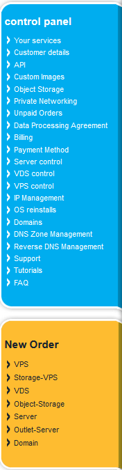
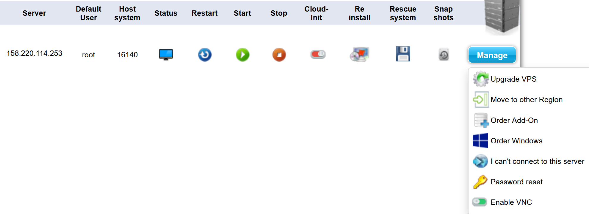

# *How To:* Use Contabo

[Contabo](https://contabo.com/) is our Cloud hosting provider of choice.

Currently, it hosts [Huey Dewey Louie](../hardware/cloud/huey-dewey-louie.md), our cloud VPS (Virtual Private Server).

This doc will explain what we use Contabo for, and common instructions for duties on Contabo.

This is the Contabo side panel, everything in blue is for *modifying current* stuff, everything in yellow is for *getting new* stuff.

# Controlling a VPS

One of the most common tasks done on Contabo is Controlling a VPS.

First, go to `VPS Control` in the `control panel` section of the side panel.

This will list every VPS owned by the society, and provide common actions for them.

## VPS Controls

Above is all actions and information on the VPS that can be seen / done.

| Item                                 | Purpose                                                                                                       |
| ------------------------------------ | ------------------------------------------------------------------------------------------------------------- |
| **`Server`**                         | The IP Address of the Server                                                                                  |
| **`Default User`**                   | The default user, normally `root`                                                                             |
| **`Host System`**                    | The actual physical server the VPS is running on. Only relevant when getting support.                         |
| **`Status`**                         | An icon showing whether the VPS is running or not.                                                            |
| **`Restart`**                        | A button that issues that restarts the VPS.                                                                   |
| **`Start`**                          | A button that starts the VPS if it is off.                                                                    |
| **`Stop`**                           | A button that stops the VPS.                                                                                  |
| **`Cloud-Init`**                     | Turns on cloud automation features. (Not used)                                                                |
| **`Reinstall`**                      | Install an OS on the VPS **WARNING:** This will delete all data on the VPS. Get permission before doing this! |
| **`Rescue System`**                  | Starts a secondary, 'rescue' system which helps you fix the OS, or pull data.                                 |
| **`Snapshots`**                      | Captures a 'snapshot' (Full system copy) that deletes itself after 30 days.                                   |
| **`Upgrade VPS`**                    | Allows you to change the specs of the VPS.                                                                    |
| **`Move to other Region`**           | Changes which data centre the VPS is running in.                                                              |
| **`Order Add-On`**                   | Get additional items for the VPS.                                                                             |
| **`Order Windows`**                  | Purchases a Windows Server license.                                                                           |
| **`I can't connect to this server`** | Provides helpful troubleshooting steps if you cannot connect to the VPS.                                      |
| **`Password reset`**                 | Resets the password of the `Default user`. Use as a lifeboat!                                                 |
| **`Enable VNC`**                     | Enables an emergency, insecure, connection method to the VPS. Use as a lifeboat!                              |

## What Do We Normally Press?

Admittedly, not much!

You'll most often go on the VPS Controls to grab a snapshot before doing something which could cause:

- Data Loss
- Downtime

The rest we will normally do through a terminal, such as restarting, starts & stops, etc.

We will VERY VERY rarely modify the specs & addons for the VPS, as this changes the annual cost.

The VPSes are spec'd out (Defining what they will do, what they need to do that, and adding some hardware buffers) before being acquired, so shouldn't need additional changes.

# DNS Zone Management

For all DNS related changes, read [this guide](./dns.md).
